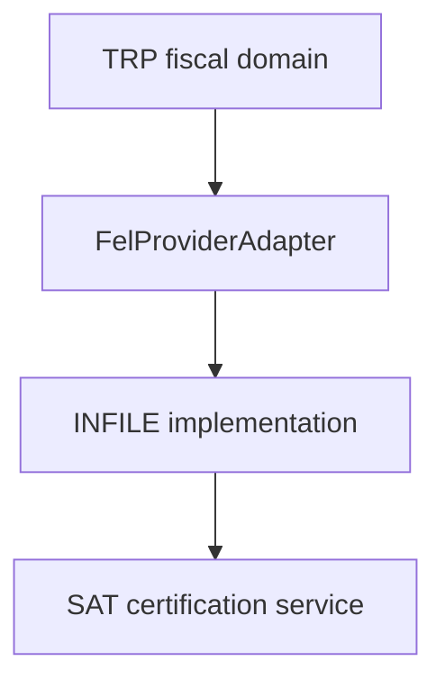
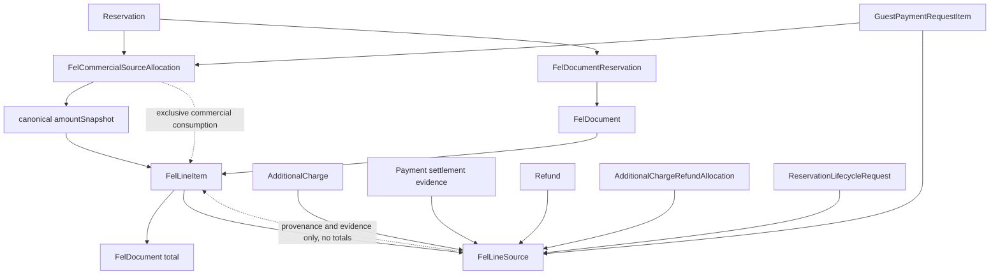
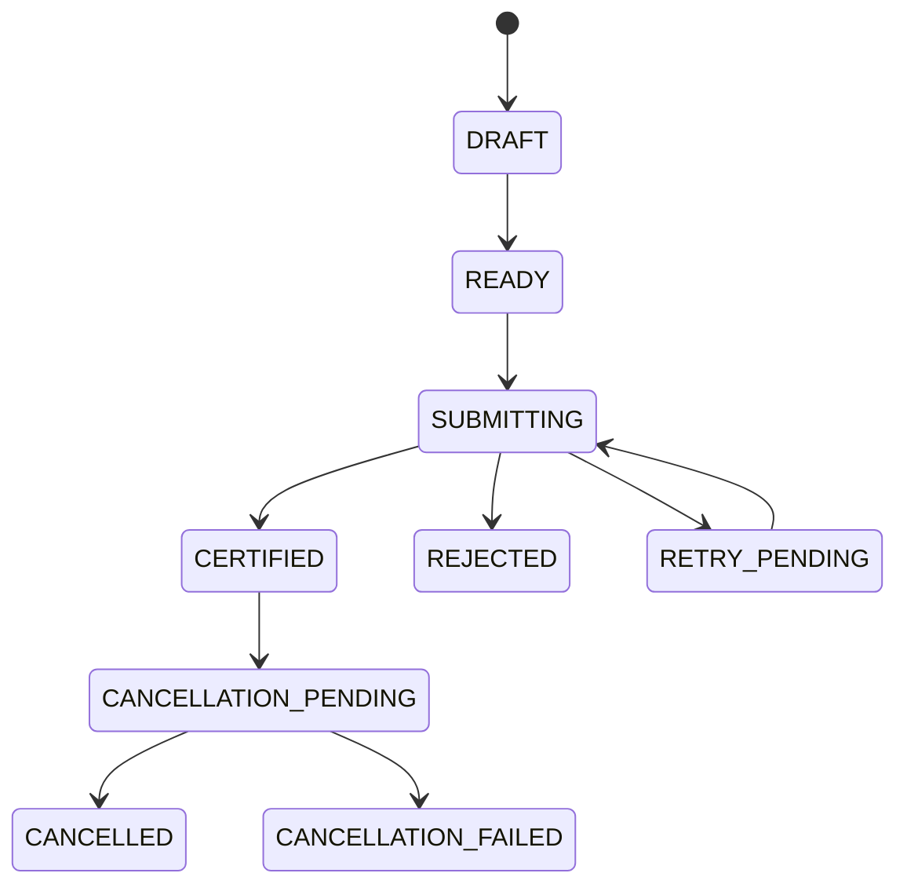
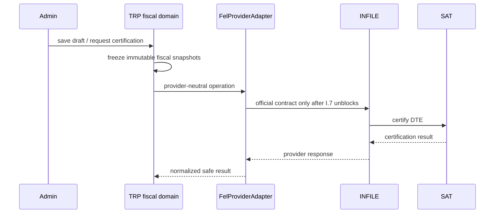

# 213 - Final-I.5: FEL Fiscal Domain Contract and Architecture

## Record

```text
Project: TRP Booking
Track: Final-I - Operational Polish, Notification UX & FEL Invoicing
Subphase: Final-I.5 - FEL/INFILE fiscal domain contract and architecture
Status: Implementation completed; owner architecture acceptance pending
Implementation base head: 999b6c0eb60d30e5b289d46996e9b1ab4602ba96
Final-I.1 status: Completed and accepted on 2026-09-29
Final-I.2 status: Completed and accepted on 2026-09-29
Final-I.3 status: Completed and accepted on 2026-09-29
Final-I.4 status: Completed and accepted on 2026-09-30
Final-I.6 status: Next / Not started
Final-I.7 status: Blocked pending official INFILE technical documentation + Test credentials
Final-I.8 status: Not started
Final-I.9 status: Not started
Phase 13 status: Blocked / Not started until Final-I closes
```

Final-I.5 is an architecture and domain-contract subphase. It does not modify `prisma/schema.prisma`, does not create migrations, does not create Admin FEL UI, does not call INFILE, does not add environment variables, and does not add a FEL cron. Final-I.6 remains the next implementation subphase and is not started by this record.

## Verified External FEL Baseline

The following baseline is the only external fiscal baseline frozen by Final-I.5. Do not broaden it without authoritative SAT/provider/accounting support:

```text
- FEL DTEs are certified electronic documents represented in XML.
- Factura de Pequeño Contribuyente is a recognized DTE type.
- Nota de Crédito is a recognized DTE type.
- SAT technical documentation treats the main DTE schema, credit/debit-note references, and DTE annulment as separate technical concepts.
- DTE cancellation and Credit Note therefore remain distinct operations in TRP architecture.
- Current SAT guidance permits "Consumidor Final" only for invoice amounts below Q2,500.
- At Q2,500 or more, current SAT guidance requires receiver identification according to the receiver case, including NIT and alternatives defined for individuals/foreign recipients.
```

Final-I.5 does not invent exact XML element names, DTE codes, schema versions, SAT endpoints, signatures, certification payloads, or provider response fields. Exact provider/SAT technical mapping remains deferred.

## INFILE Boundary

Current public INFILE material advertises ERP/software integration and a REST/JSON API product for purchases/sales. This does not equal the exact TRP certification contract:

```text
public marketing/API information != exact TRP certification contract
```

Final-I.7 remains blocked until the owner provides official INFILE technical documentation and Test credentials. Until then, TRP must not invent:

```text
- base URLs
- endpoint paths
- authentication
- headers
- signatures
- certification JSON
- idempotency headers
- status lookup
- cancellation calls
- credit-note calls
- PDF/XML calls
- provider error codes
```

## Current Financial Domain Audit

Final-I.5 reviewed the current `main` schema and the active services that confirm reservations, complete lifecycle adjustments, create/pay additional charges, and process refunds.

Current `Reservation` commercial fields:

```text
id
propertyId
guestName / guestEmail / guestPhone / guestCountry
checkInDate
checkOutDate
guestCount
status
subtotal
cleaningFee
taxes
discounts
total
currency
pricingSnapshot
confirmedAt
cancelledAt
createdAt
updatedAt
```

Current `ReservationLifecycleRequest` preserves immutable before/after commercial snapshots:

```text
originalSubtotal
originalCleaningFee
originalTaxes
originalDiscounts
originalTotal
originalPricingSnapshot

requestedSubtotal
requestedCleaningFee
requestedTaxes
requestedDiscounts
requestedTotal
requestedPricingSnapshot

financialDifference
```

Current payment purposes are:

```text
INITIAL_RESERVATION
LIFECYCLE_ADJUSTMENT
ADDITIONAL_CHARGE
```

Current additional-charge settlement is represented by:

```text
AdditionalCharge
GuestPaymentRequest
GuestPaymentRequestItem
Payment purpose ADDITIONAL_CHARGE
```

`GuestPaymentRequestItem` already freezes immutable paid-item evidence:

```text
categorySnapshot
descriptionSnapshot
amountSnapshot
currencySnapshot
```

Current refunds are represented by:

```text
Refund
AdditionalChargeRefundAllocation
```

`lib/reservations/financial-summary.ts` already derives the stay financial summary from `Reservation.total` as current stay value, eligible `INITIAL_RESERVATION` and completed positive `LIFECYCLE_ADJUSTMENT` settlement payments, and additional-charge captured/refunded amounts separately. Final-I.5 builds on that accepted model instead of redefining the business ledger.

## Core Rule: Payment Is Not A Fiscal Line

```text
PAYMENT != FISCAL LINE
```

A `Payment` proves financial settlement. A `Payment` is not automatically an invoice line.

Therefore:

```text
INITIAL_RESERVATION Payment.amount must not be added on top of Reservation.total.
LIFECYCLE_ADJUSTMENT Payment.amount must not become a separate fiscal service line when that adjustment is already represented in the final Reservation financial state.
ADDITIONAL_CHARGE Payment.amount is settlement evidence for immutable GuestPaymentRequestItem snapshots, not the line source by itself.
```

This rule prevents TRP from double-counting the stay.

## Lodging Source Of Truth

For a reservation selected into a future FEL draft, the lodging fiscal source is the final current commercial state of that reservation at the moment the FEL draft snapshot is created.

The snapshot must conceptually freeze:

```text
reservationId
propertyId
propertyName
final check-in
final check-out
final guest count

subtotal
cleaningFee
taxes
discounts
total
currency
pricingSnapshot

snapshotCreatedAt
sourceReservationUpdatedAt
```

After the fiscal snapshot exists, later edits to the mutable `Reservation` must not silently mutate a saved FEL draft. After certification, later `Reservation` changes must never mutate the certified fiscal representation.

## Lifecycle Adjustments And Lodging

A completed Date Change / Stay Extension may have:

```text
originalTotal
requestedTotal
financialDifference
LIFECYCLE_ADJUSTMENT Payment
Refund
```

The fiscal lodging line is not:

```text
original stay line
+
lifecycle payment line
```

The target state is one lodging representation based on the final accepted stay, unless future fiscal/accounting rules explicitly require a different representation. Settlement evidence can reference the lifecycle `Payment` or `Refund`, but must not automatically become another invoice line.

## Additional-Charge Source Of Truth

Additional charges are commercially separate from `Reservation.total`.

Preferred source hierarchy for eligible extras:

```text
AdditionalCharge identity
+
GuestPaymentRequestItem immutable snapshot
+
associated APPROVED ADDITIONAL_CHARGE Payment
+
approved refund allocations, when any
```

Do not rebuild historical extra descriptions or amounts solely from mutable `AdditionalCharge.description` / `AdditionalCharge.amount` when a `GuestPaymentRequestItem` immutable snapshot exists.

## Eligible Extra-Charge Concept

A charge is a candidate fiscal extra when it has been successfully settled and is attributable to a selected reservation.

Current statuses and Final-I.5 treatment:

| Status | I.5 fiscal treatment |
| --- | --- |
| `PENDING` | Excluded. It is not invoiceable as a collected extra. |
| `PAID` | Normal invoice candidate using the immutable `GuestPaymentRequestItem` snapshot and approved `ADDITIONAL_CHARGE` payment evidence. |
| `PARTIALLY_REFUNDED` | Candidate with a fiscal-reconciliation flag until exact fiscal treatment is frozen. Preserve gross snapshot, approved allocations, and remaining/refunded evidence. |
| `REFUNDED` | Preserve source/history; do not silently invoice the gross amount. Requires fiscal reconciliation if considered for a document. |
| `CANCELLED` | Excluded. It is not invoiceable as a collected extra. |

Final-I.5 does not invent tax-law treatment for partially refunded or refunded items. It freezes that enough immutable facts must be preserved for a later fiscal decision.

## Pre-Issue Refunds And Post-Issue Refunds

TRP must distinguish:

```text
refund happened BEFORE FEL certification
refund happened AFTER FEL certification
```

Both cases must preserve:

```text
commercial refund evidence
fiscal reconciliation decision
```

Final-I.5 does not freeze a legal rule that every pre-issue refund reduces the DTE or that every post-issue refund creates a Credit Note. Certification must be blockable when unresolved fiscal reconciliation exists.

## Anti-Double-Counting Algorithm

The future FEL draft builder must use this deterministic anti-double-counting algorithm:

```text
for each selected Reservation:

  lodgingGross =
    final frozen Reservation.total

  do NOT separately add:
    INITIAL_RESERVATION Payment.amount
    LIFECYCLE_ADJUSTMENT Payment.amount

  inspect paid additional-charge snapshots

  include each eligible additional charge exactly once

  associate refunds/allocations as reconciliation metadata

invoiceCommercialGross =
  sum(frozen lodging amounts)
  + sum(eligible extra source amounts)
```

Then:

```text
invoiceFiscalTotal
```

must be produced from frozen fiscal lines, not independently recalculated later. Subject to later currency/tax rules:

```text
sum(FelLineItem.amount) == FelDocument frozen total
```

Do not independently recompute document totals from `Reservation`, `Payment`, `AdditionalCharge`, or `FelLineSource` after the draft snapshot has been built.

```text
FelDocument commercial total
=
sum(FelLineItem.amount)
```

subject only to later accepted fiscal tax/currency/rounding rules.

## Canonical Commercial Amount Source

Final-I.5 freezes one canonical commercial amount source for future FEL draft composition:

```text
FelCommercialSourceAllocation.amountSnapshot
FelCommercialSourceAllocation.currencySnapshot
```

These are the only canonical commercial source amounts used to construct fiscal line totals.

```text
FelCommercialSourceAllocation
=
exclusive source ownership
+
canonical immutable commercial amount snapshot
```

For current commercial-currency draft composition:

```text
FelLineItem.amount
=
sum(
  FelCommercialSourceAllocation.amountSnapshot
  linked to this FelLineItem
)
```

subject only to later accepted:

```text
currency conversion
tax treatment
rounding
```

rules.

`FelLineItem.amount` is built from allocation snapshots. `FelDocument` totals are built from persisted line amounts. No later implicit recalculation from mutable business tables is allowed.

## Fiscal Provenance vs Commercial Source Consumption

Final-I.5 freezes two separate concepts:

```text
Fiscal line provenance/evidence

Fiscal commercial-source consumption
```

They are related but not interchangeable.

`FelLineSource` exists to answer:

```text
Why does this fiscal line exist?
Which commercial/payment/refund/lifecycle records support it?
```

It must not be treated as the authoritative duplicate-invoice prevention mechanism.

```text
FelLineSource != fiscal source consumption lock
```

A polymorphic `sourceType` / `sourceId` mapping cannot provide database foreign-key integrity to every source table and cannot by itself guarantee that the same commercial amount source is not invoiced twice. Indexes improve lookup performance. Indexes do not prevent duplicate consumption. Unique constraints / allocation ownership prevent duplicate fiscal consumption.

## FelLineSource Role Semantics And Amount Invariant

`FelLineSource` must distinguish amount-producing commercial sources from supporting settlement/refund/lifecycle evidence through:

```text
sourceRole
```

Provider-independent conceptual roles:

```text
AMOUNT_SOURCE
SETTLEMENT_EVIDENCE
REFUND_EVIDENCE
LIFECYCLE_EVIDENCE
```

FelLineSource rows are never summed to compute:

```text
FelLineItem.amount
or
FelDocument.total
```

This applies even when:

```text
sourceRole = AMOUNT_SOURCE
```

`AMOUNT_SOURCE` means:

```text
this evidence row identifies/explains the commercial source represented by an allocation
```

It does not create a second monetary source of truth.

Payment evidence contributes zero additional fiscal amount.

### Lodging Role Rules

```text
Reservation frozen commercial snapshot
-> AMOUNT_SOURCE
```

```text
INITIAL_RESERVATION Payment
-> SETTLEMENT_EVIDENCE
-> contributes 0 additional fiscal amount
```

```text
LIFECYCLE_ADJUSTMENT Payment
-> SETTLEMENT_EVIDENCE
-> contributes 0 additional fiscal amount
```

```text
ReservationLifecycleRequest
-> LIFECYCLE_EVIDENCE
-> contributes 0 additional fiscal amount
```

For lodging, the fiscal line has exactly one Reservation allocation. The Reservation `AMOUNT_SOURCE` provenance row explains that allocation and is not arithmetic input.

### Additional-Charge Role Rules

Canonical amount source:

```text
GuestPaymentRequestItem immutable snapshot
-> AMOUNT_SOURCE
```

Related identity/provenance:

```text
AdditionalCharge
-> provenance / identity evidence
-> not a second amount contribution
```

Associated settlement:

```text
ADDITIONAL_CHARGE Payment
-> SETTLEMENT_EVIDENCE
-> not a second amount contribution
```

Refund/reconciliation evidence:

```text
Refund / AdditionalChargeRefundAllocation
-> REFUND_EVIDENCE
-> not blindly added or subtracted from the fiscal line
-> reconciliation rules remain separate
```

For an individual extra, the fiscal line has exactly one `GuestPaymentRequestItem` allocation. The `GuestPaymentRequestItem` `AMOUNT_SOURCE` provenance row explains that allocation and is not arithmetic input.

For grouped extras, the fiscal line has multiple `GuestPaymentRequestItem` allocations:

```text
FelLineItem.amount
=
sum(FelCommercialSourceAllocation.amountSnapshot)
```

subject only to later frozen currency/tax/rounding rules. Settlement/refund/lifecycle evidence and all `FelLineSource` rows are excluded from that sum.

## Anti-Double-Counting Example

Scenario:

```text
Initial reservation total: USD 300
Guest pays USD 300

Guest later extends stay
Final reservation total becomes USD 380
Guest pays USD 80 lifecycle adjustment

Guest also pays:
Transportation USD 40
Damage USD 25
```

Incorrect invoice:

```text
300
+ 80
+ 380
+ 40
+ 25
= duplicated
```

Correct commercial source model:

```text
Lodging final snapshot: USD 380

Transport extra snapshot: USD 40

Damage extra snapshot: USD 25

Commercial gross represented by fiscal source snapshots:
USD 445
```

The USD 300 initial payment and USD 80 lifecycle payment are settlement evidence only.

## One Document, One Or Multiple Reservations

```text
one document -> multiple reservations
FelDocument 1 --- N FelDocumentReservation
```

One FEL document may cover one or multiple reservations. Each linked reservation must preserve its own frozen stay snapshot. A multi-reservation invoice must not collapse reservation provenance.

Before multiple reservations enter the same fiscal document, the architecture requires compatibility:

```text
- same intended fiscal receiver
- compatible currency treatment
- compatible document type
- invoice-eligible status
- not already fiscally consumed in an incompatible way
```

Exact currency compatibility remains unresolved until USD/GTQ rules are frozen.

## Fiscal Receiver

```text
fiscal receiver != booking guest
Reservation guest != fiscal receiver
```

A future FEL draft must capture a receiver snapshot independent from reservation guest fields.

Conceptual receiver fields:

```text
receiverName
receiverTaxIdentifierType
receiverTaxIdentifier
receiverAddress
receiverEmail
country
```

Do not freeze final provider field names. The receiver snapshot must be immutable once certified.

Current verified SAT business rule:

```text
amount below Q2,500
-> current SAT guidance may allow Consumidor Final

amount Q2,500 or greater
-> receiver identification required according to receiver type
```

Future validation must be able to support:

```text
NIT
CUI where legally applicable
foreign passport / foreign tax identifier where applicable
Consumidor Final when legally eligible
```

Exact normalization and validation remain part of later implementation/fiscal contract refinement.

## Candidate Document Types

Provider-independent semantic document types:

```text
SMALL_TAXPAYER_INVOICE
CREDIT_NOTE
```

Do not use undocumented SAT/INFILE short codes yet.

Model conceptually:

```text
document cancellation
```

as an operation/state on an existing certified document. Do not represent cancellation as a negative invoice.

## Fiscal Lifecycle

Base state machine:

```text
DRAFT
READY
SUBMITTING
CERTIFIED
REJECTED
RETRY_PENDING
```

Conceptual cancellation states may later include:

```text
CANCELLATION_PENDING
CANCELLED
CANCELLATION_FAILED
```

Allowed base transitions:

```text
DRAFT -> READY
READY -> SUBMITTING
SUBMITTING -> CERTIFIED
SUBMITTING -> REJECTED
SUBMITTING -> RETRY_PENDING
RETRY_PENDING -> SUBMITTING
CERTIFIED -> CANCELLATION_PENDING
CANCELLATION_PENDING -> CANCELLED
CANCELLATION_PENDING -> CANCELLATION_FAILED
```

No editing fiscal snapshots after CERTIFIED.

## Credit Note Relationship

```text
Credit Note != Refund
Refund != Credit Note
```

A `Refund` is a payment-domain object. A `Credit Note` is a fiscal-domain object.

A future Credit Note may have allocation relationships to:

```text
original FelDocument
original FelLineItem
Refund
AdditionalChargeRefundAllocation
ReservationLifecycleRequest
```

Do not automatically create a Credit Note from every Refund.

Credit Note does not release original source consumption:

```text
Credit Note does NOT consume the original Reservation or GuestPaymentRequestItem again.
Credit Note must NOT delete/release the original FelCommercialSourceAllocation.
```

Credit Notes adjust certified fiscal documents/lines through `FelCreditAllocation` and relevant payment/refund/reconciliation evidence; they do not make the original commercial source available for a second unrelated normal invoice.

## Cancellation Relationship

```text
Reservation cancellation != Payment refund != FEL DTE cancellation != Credit Note
```

Examples:

```text
- A reservation may be cancelled before any DTE exists; that does not imply DTE cancellation.
- A payment refund may happen for customer-service or overpayment reasons; that does not automatically create a Credit Note.
- A certified DTE may require DTE cancellation without a new payment refund if the provider/accounting contract says so.
- A Credit Note may adjust a certified DTE line without changing the historical Reservation record.
```

Do not infer fiscal actions from reservation state transitions.

## Proposed Persistence Model For Final-I.6

Final-I.5 proposes the following Prisma models for Final-I.6. These are not implemented in this subphase.

```text
FelDocument
FelDocumentReservation
FelLineItem
FelLineSource
FelCommercialSourceAllocation
FelProviderAttempt
FelCreditAllocation
```

### FelDocument

Proposed conceptual fields:

```text
id

documentType
status

currency

receiverType
receiverName
receiverIdentifierType
receiverIdentifier
receiverAddress
receiverEmail
receiverCountry

subtotal
discounts
taxes
total

groupExtras

originalDocumentId

certificationUuid
series
number
certifiedAt

cancelledAt

createdByAdminId
createdAt
updatedAt
```

Unresolved provider-specific fields must remain nullable/deferred until official INFILE documentation exists.

### FelDocumentReservation

Proposed reservation snapshot/provenance fields:

```text
felDocumentId
reservationId

propertyId
propertyNameSnapshot

checkInDate
checkOutDate
guestCount

subtotalSnapshot
cleaningFeeSnapshot
taxesSnapshot
discountsSnapshot
totalSnapshot
currencySnapshot
pricingSnapshot

reservationUpdatedAtSnapshot
```

Both relation IDs and snapshots are required: relation IDs preserve operational traceability; snapshots preserve the fiscal representation even when mutable operational records later change.

### FelLineItem

Fiscal lines are immutable after certification.

Proposed conceptual fields:

```text
felDocumentId
lineNumber

kind
description
quantity
unitPrice
amount
currency

tax/fiscal fields - deferred until official contract

createdAt
```

Potential semantic `kind` values:

```text
LODGING
ADDITIONAL_CHARGE
GROUPED_ADDITIONAL_CHARGES
```

Do not invent SAT item codes.

### FelLineSource

Every fiscal line must remain traceable to the records that explain it. `FelLineSource` is the complete provenance/evidence graph, not the exclusive commercial amount-source ownership model.

Chosen design:

```text
FelLineSource:
  id
  felLineItemId
  sourceType
  sourceId
  sourceRole
  sourceSnapshotJson
  createdAt
```

`sourceType` is a closed TRP enum concept, not arbitrary text. Conceptual values:

```text
RESERVATION
ADDITIONAL_CHARGE
GUEST_PAYMENT_REQUEST_ITEM
PAYMENT
REFUND
ADDITIONAL_CHARGE_REFUND_ALLOCATION
RESERVATION_LIFECYCLE_REQUEST
```

`sourceRole` is also a closed TRP enum concept:

```text
AMOUNT_SOURCE
SETTLEMENT_EVIDENCE
REFUND_EVIDENCE
LIFECYCLE_EVIDENCE
```

This typed-source architecture avoids seven nullable foreign keys on one row while avoiding JSON-only provenance. Final-I.6 should prefer a relational `FelLineSource` mapping with indexes over `sourceType/sourceId` and `felLineItemId` for evidence lookup performance only; `sourceSnapshotJson` stores bounded immutable evidence only when the source row itself is mutable or insufficient for fiscal reproduction.

`FelLineSource` deliberately has no mandatory independent amount/currency columns. Supporting monetary evidence may live inside `sourceSnapshotJson` when useful for audit/reproduction, but that diagnostic/audit metadata is never arithmetic input.

`FelLineSource` does not provide exclusive source ownership:

```text
FelLineSource != fiscal source consumption lock
```

Indexes over `sourceType/sourceId` improve lookup performance, but indexes do not prevent duplicate consumption. Unique constraints / allocation ownership prevent duplicate fiscal consumption.

### FelCommercialSourceAllocation

`FelCommercialSourceAllocation` is the exclusive commercial amount-source ownership model.

```text
FelCommercialSourceAllocation
=
exclusive commercial amount-source ownership
+
canonical immutable commercial amount snapshot
```

It is separate from `FelLineSource`:

```text
FelLineSource
=
complete provenance/evidence graph
```

Proposed conceptual structure:

```text
FelCommercialSourceAllocation:
  id

  felDocumentId
  felLineItemId

  reservationId?
  guestPaymentRequestItemId?

  amountSnapshot
  currencySnapshot

  createdAt
```

`amountSnapshot` and `currencySnapshot` are the canonical commercial amount/currency copied into the draft for that source. Future line totals must be derived from these allocation snapshots, not from `FelLineSource`, mutable `Reservation`, mutable `AdditionalCharge`, `Payment`, `Refund`, or provider evidence rows.

Relations:

```text
felDocumentId -> FelDocument
felLineItemId -> FelLineItem

reservationId -> Reservation
guestPaymentRequestItemId -> GuestPaymentRequestItem
```

Exactly one canonical commercial source must be present:

```text
reservationId XOR guestPaymentRequestItemId
```

This model deliberately covers only the commercial amount sources currently accepted by I.5:

```text
Reservation lodging
GuestPaymentRequestItem extra
```

Do not put `Payment`, `Refund`, `AdditionalChargeRefundAllocation`, `ReservationLifecycleRequest`, or other supporting evidence into this consumption table. Those remain `FelLineSource` evidence.

Final-I.6 must enforce:

```text
reservationId UNIQUE when non-null

guestPaymentRequestItemId UNIQUE when non-null

exactly one canonical commercial source

exactly one of reservationId or guestPaymentRequestItemId is non-null
```

Because PostgreSQL permits multiple NULL values in a normal unique constraint, these two nullable unique columns allow the XOR model while preventing the same actual commercial source from being allocated twice. The XOR invariant should be enforced at database/application level; preferred later implementation is a PostgreSQL CHECK constraint if Prisma cannot express the XOR directly. The migration may need explicit SQL for this CHECK.

This gives actual DB-level protection against:

```text
same Reservation lodging
-> invoice A
-> invoice B
```

and:

```text
same GuestPaymentRequestItem
-> invoice A
-> invoice B
```

### Grouping Extra Charges

Owner may choose:

```text
individual/grouped extras

individual extras
```

or:

```text
one grouped invoice line
```

Example:

```text
Transportation 40
Damage 25
Late checkout 20
```

Displayed grouped fiscal line:

```text
Servicios y cargos adicionales - 85
```

Grouping must preserve provenance. Never lose:

```text
category
description
amount
source IDs
refund allocations
```

because of grouping. A grouped line must have multiple `FelLineSource` rows, one per original commercial source.

Grouped extras preserve multiple allocations.

Future grouped persistence example:

```text
FelLineItem
  "Servicios y cargos adicionales"
  amount = 85

FelCommercialSourceAllocation
  GuestPaymentRequestItem transport -> 40

FelCommercialSourceAllocation
  GuestPaymentRequestItem damage -> 25

FelCommercialSourceAllocation
  GuestPaymentRequestItem late checkout -> 20
```

plus any supporting `FelLineSource` evidence.

Then:

```text
FelLineItem.amount
=
40 + 25 + 20
=
85
```

The corresponding `FelLineSource` rows may explain all underlying records but cannot alter the `85`.

```text
grouping changes presentation
NOT consumption identity
NOT provenance
```

```text
grouping presentation derives from allocations
not from provenance arithmetic
```

Individual extra example:

```text
FelLineItem
  "Transporte (Desde Antigua a Panajachel)"
  amount = 40

FelCommercialSourceAllocation
  GuestPaymentRequestItem X
  amountSnapshot = 40
```

Then:

```text
FelLineItem.amount
=
allocation.amountSnapshot
```

The associated `AdditionalCharge`, `Payment`, `Refund`, and `AdditionalChargeRefundAllocation` rows may be represented as supporting `FelLineSource` evidence, not additional commercial allocations.

Lodging example:

```text
FelLineItem
  "Reservacion del 15 al 16 de Agosto (1 noche)"
  amount = frozen Reservation.total

FelCommercialSourceAllocation
  Reservation X
  amountSnapshot = frozen Reservation.total
```

Then:

```text
FelLineItem.amount
=
that allocation.amountSnapshot
```

Initial and lifecycle payments can be linked as evidence but cannot create additional allocation rows.

### FelProviderAttempt

Conceptual fields:

```text
documentId
operation
attemptNumber
status
startedAt
finishedAt

requestFingerprint / idempotency reference
safe provider reference

error classification
safe error code/message

response metadata
```

Do not store secrets. Do not blindly persist unrestricted raw provider payloads if they may contain sensitive fiscal data. Store normalized, bounded, sanitized metadata.

### FelCreditAllocation

Conceptual role:

```text
maps a Credit Note or fiscal adjustment back to original FelDocument/FelLineItem rows and relevant payment-domain evidence.
```

Potential sources:

```text
Refund
AdditionalChargeRefundAllocation
ReservationLifecycleRequest
```

## Invoice Eligibility

Current TRP product rule:

```text
reservation is invoice-eligible after checkout
```

This is a TRP application eligibility rule, not an assertion of Guatemala statutory timing.

Architecture should consider at minimum:

```text
- reservation exists
- eligible lifecycle state
- checkout has occurred in America/Guatemala business time
- not blocked by unresolved lifecycle mutation
- commercial currency known
- receiver input available
- no unresolved fiscal reconciliation blocker
- no incompatible fiscal-consumption conflict
```

## Prevent Duplicate Invoicing

TRP needs commercial-source allocation ownership rather than a simple `reservation.invoiceId` or a polymorphic evidence index.

Rules:

```text
- A reservation lodging snapshot can be fiscally consumed only through one active/permanent FelCommercialSourceAllocation.
- A GuestPaymentRequestItem extra snapshot can be fiscally consumed only through one active/permanent FelCommercialSourceAllocation.
- A Credit Note may reference certified fiscal lines without making the original commercial source available for duplicate invoicing.
- FelLineSource is provenance/evidence only.
- FelCommercialSourceAllocation is the duplicate-invoice prevention boundary.
```

Database-enforceable constraints required for Final-I.6:

```text
reservationId UNIQUE when non-null

guestPaymentRequestItemId UNIQUE when non-null

reservationId XOR guestPaymentRequestItemId
```

Indexes improve lookup performance. Unique constraints / allocation ownership prevent duplicate fiscal consumption. An ordinary index over `sourceType/sourceId` does not prevent duplicate consumption.

Credit Note does NOT consume the original Reservation or GuestPaymentRequestItem again. Instead:

```text
Credit Note
-> FelCreditAllocation
-> original certified FelDocument / FelLineItem
```

with relevant Refund/reconciliation evidence. Creating a Credit Note must NOT delete/release the original `FelCommercialSourceAllocation`.

DTE cancellation must not automatically make the original commercial source available for a second unrelated invoice unless a later explicit fiscal rule says so.

## Allocation And Provenance Correspondence

Every canonical allocation should have corresponding provenance sufficient to explain it:

```text
Reservation allocation
-> at least one Reservation AMOUNT_SOURCE provenance row

GuestPaymentRequestItem allocation
-> at least one GPRI AMOUNT_SOURCE provenance row
```

But:

```text
allocation amount is authoritative

provenance role is explanatory
```

Do not create two authoritative amount stores.

## Snapshot Consistency At Draft Creation

When Final-I.6 creates a draft transactionally, it must copy commercial source amounts exactly once into allocation snapshots.

For lodging:

```text
Reservation.total
-> copied once into
FelCommercialSourceAllocation.amountSnapshot
```

For extras:

```text
GuestPaymentRequestItem.amountSnapshot
-> copied once into
FelCommercialSourceAllocation.amountSnapshot
```

Then build:

```text
FelLineItem.amount
```

from those allocation snapshots.

Do not later read mutable source records to recalculate the saved draft implicitly.

## Draft Editing Rules

Before certification, `DRAFT` may allow:

```text
- receiver edits
- reservation selection changes
- grouped/individual extras choice
- description preview changes within accepted rules
```

However, source snapshots must be deliberately refreshed or rebuilt, not silently drift with database changes.

Two explicit admin choices:

```text
Rebuild draft from current commercial sources
continue with existing frozen draft snapshot
```

Do not let mutable reservations silently alter a saved `DRAFT`.

When Admin explicitly chooses `Rebuild draft from current commercial sources`, the operation should transactionally:

```text
release eligible provisional allocations
re-read current eligible commercial sources
create fresh allocation snapshots
rebuild fiscal lines from allocations
rebuild provenance/evidence
```

Do not patch individual amounts in place in a way that can leave allocation/line totals inconsistent.

When a `DRAFT` includes a commercial source, `FelCommercialSourceAllocation` is created transactionally so two concurrent Admin drafts cannot silently claim the same source.

If a source is removed from a mutable `DRAFT`, its allocation may be deleted/released transactionally provided the document has never been certified. A discarded draft may release its provisional allocations.

When a document becomes immutable/certified, its allocations are permanent and must never be deleted merely to make the source invoiceable again.

Draft creation/update must use transactional locking/recheck around canonical sources to avoid race conditions between concurrent Admin actions.

## Certified Immutability

After `CERTIFIED`, freeze:

```text
receiver snapshot
reservation snapshots
line items
line-source allocations
commercial source allocations
FelCommercialSourceAllocation.amountSnapshot
FelCommercialSourceAllocation.currencySnapshot
FelLineItem.amount
FelDocument totals
currency
totals
certification identifiers
certification timestamps
```

Corrections after certification must happen through fiscal operations such as cancellation or Credit Note when allowed by the later provider/accounting contract. Never edit a certified invoice in place.

After certification, no fiscal amount may be recalculated from mutable business tables. `FelLineSource` evidence may also be immutable as accepted history, but it remains provenance and never becomes an arithmetic source.

## Provider Adapter Boundary



The Admin UI and Prisma domain must not know INFILE request JSON shapes.

Conceptual adapter operations may eventually include:

```text
certify
lookup/status
cancel
createCreditNote
retrievePdf
retrieveXml
```

These operations are conceptual only. Do not implement them yet and do not freeze signatures until official docs exist.

## Timeout And Duplicate-Certification Safety

```text
timeout after request != safe to resubmit
```

If a certification request may have reached the provider, TRP must reconcile provider status/idempotency before resubmission. Exact mechanism remains blocked on official INFILE docs. This is a hard requirement for Final-I.7.

Retry classification:

```text
transport/network failure
provider 5xx / temporary failure
-> possibly retryable

validation/business rejection
-> non-retryable until corrected

unknown outcome after timeout
-> reconciliation required before retry
```

No retry implementation is added by I.5.

## Currency Architecture

TRP commercial data currently uses USD.

Do not silently convert USD to GTQ.

Future fiscal currency snapshot concept:

```text
commercialCurrency
fiscalCurrency
exchangeRate
exchangeRateSource
exchangeRateTimestamp
rounding policy
```

Exact requirements are unresolved. Final-I.5 does not add these fields to Prisma.

## Domain Relationship Diagram



## Fiscal State Machine Diagram



## Provider Boundary Diagram



## Open-Question Register

| Question | Why it matters | Dependency | Blocks I.6? | Blocks I.7? | Current status |
| --- | --- | --- | --- | --- | --- |
| USD vs GTQ | Determines document currency and totals. | Owner / accountant / SAT / INFILE | No, if fields are deferred/generic | Yes | Open |
| Exchange rate source | Needed if fiscal currency differs from commercial USD. | Accountant / SAT / INFILE | No | Yes | Open |
| Exchange rate precision/rounding | Prevents certification mismatch. | SAT / INFILE | No | Yes | Open |
| Tax representation for Pequeno Contribuyente | Determines line/tax fields. | Accountant / SAT / INFILE | No, if tax fields are deferred | Yes | Open |
| Receiver field requirements | Determines receiver form and validation. | SAT / INFILE / accountant | Partially; generic receiver model can proceed | Yes | Open |
| CF/NIT/CUI/passport behavior | Determines identification validation. | SAT / accountant | No, if generic identifier type is used | Yes | Open |
| Multi-reservation receiver compatibility | Prevents invalid grouping under one receiver. | Owner / accountant | Partially | No | Open |
| Pre-issue refunded amounts | Determines whether draft blocks or adjusts lines. | Accountant / SAT | Partially | No | Open |
| Post-issue refunds | Determines later fiscal reconciliation. | Accountant / SAT | No | Yes | Open |
| When Credit Note is required | Avoids incorrect fiscal adjustment. | Accountant / SAT / INFILE | No | Yes | Open |
| When cancellation is appropriate | Separates DTE annulment from Credit Note. | Accountant / SAT / INFILE | No | Yes | Open |
| INFILE exact certification contract | Required for provider adapter. | INFILE official docs / Test credentials | No | Yes | Blocked |
| Idempotency | Prevents duplicate certification. | INFILE official docs | No | Yes | Blocked |
| Status lookup/reconciliation | Required after timeout/unknown outcome. | INFILE official docs | No | Yes | Blocked |
| PDF | Determines delivery/history artifact retrieval. | INFILE official docs | No | Yes | Blocked |
| XML | Determines certified XML storage/retrieval. | INFILE official docs | No | Yes | Blocked |

## What Blocks I.6 vs I.7

Final-I.6 can proceed with provider-independent persistence/UI if:

```text
- domain entities are frozen
- snapshot model is frozen
- commercial-source allocation is frozen
- draft lifecycle is frozen
- receiver model is sufficiently generic
- unresolved provider fields are nullable/deferred
- certification is unavailable/disabled
```

Final-I.7 remains blocked by:

```text
- actual INFILE transport
- credentials
- payload mapping
- auth
- certification
- status lookup
- idempotency
- cancellation
- Credit Note provider operation
- PDF/XML retrieval
- retry/reconciliation semantics
```

## Final-I.6 Implementation Plan

Expected Final-I.6 scope:

```text
- Prisma FEL persistence
- migration
- FelCommercialSourceAllocation persistence
- DB unique constraints
- XOR CHECK constraint
- transactional source claiming
- source release for mutable discarded drafts
- permanent consumption after certification
- line-source role semantics
- line amounts derived exclusively from allocation snapshots
- document totals derived exclusively from persisted line amounts
- no arithmetic over FelLineSource
- transactional consistency checks:
  sum allocations per line == line.amount
  sum lines == document total
- Admin /admin/fel route
- eligible-reservation search/select
- one/multiple reservation draft creation
- fiscal receiver form
- individual/grouped extras
- draft preview
- immutable snapshot creation
- draft history/status
- NO provider certification
```

Final-I.6 must be implementable and testable without INFILE credentials.

Conceptual Admin UX:

```text
Admin > FEL / Facturacion

Nueva factura
-> select eligible reservation(s)
-> receiver
-> invoice composition
-> extras grouping
-> preview
-> save draft
```

History concepts:

```text
Draft
Ready / waiting for provider integration
Certified
Rejected
Cancelled
Credit-related states later
```

No UI is built during Final-I.5.

## Final-I.5 Validation Ledger

```text
Implementation validation to execute:
- npm run final-i:validate
- npm run final-h:validate
- npm run env:validate
- npm run db:validate
- npm run db:generate
- npm run db:migrate:status
- npm run lint
- npm run build
- npm audit --omit=dev
- git diff --check
```

Final validation results are recorded in `docs/212-final-i-operational-polish-notification-ux-and-fel-invoicing-roadmap.md` and `docs/11-progress-log.md` when this subphase commit is finalized.
